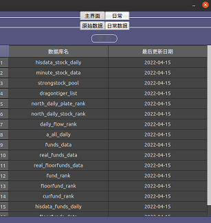
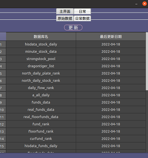
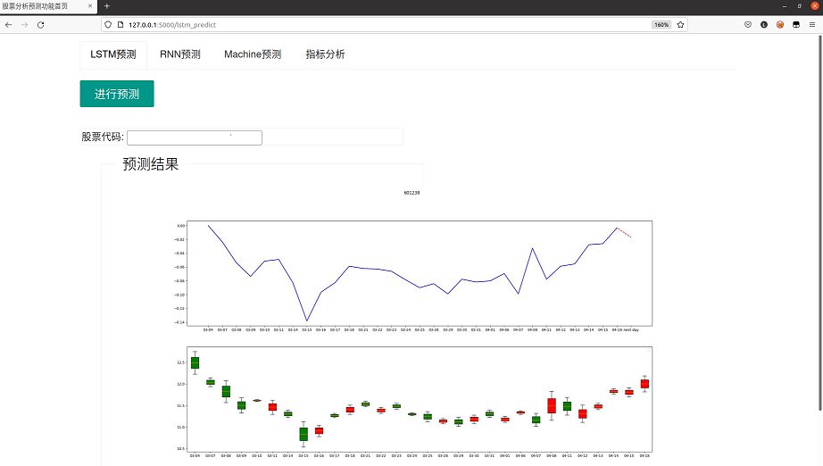

### 软件架构

##### github仓库：

**如果喜欢请给我个star!!!，十分感谢**

#### 准备工作:

- ##### 电脑必须得具备MySql数据库

建议初始化一个账号为root密码为88888888的用户

- ##### python运行环境

##### 下载python必需的库：

可直接运行命令

`pip install -r requirement.txt -i https://pypi.tuna.tsinghua.edu.cn/simple/`

##### 主要依赖库：

- PyQt5

- pyqtgraph

- pandas

- requests

- bs4

- pymysql

- sqlalchemy

- sklearn

- tensorflow

- flask

- 等等

##### 运行：

`python win_main.py`

#### 功能简述：

Qt界面：

* 主界面
  
  
  
  **主界面主要展示三大指数**
  
  
  
  **日常数据获取更新**
  
  
  
  **当点击按钮进行数据更新时，按钮状态变灰且不可再次点击，等更新完毕按钮恢复原状（所有的按钮都如此，运行状态不可重复点击）**
- 股票数据展示
  
  
  
  **1.热点股票页面**
  
  **2.北向数据和龙虎榜**
  
  **鼠标右击可进行更新**

- 交易功能
  
  
  
  **日常股票交易：**
  
  * 1.买
  
  * 2.卖
  
  * 做套（高卖低买）
  
  **目前可选策略：**
  
  * macd
  
  * kdj
  
  * 网格交易
  
  
  
  **机器盯盘，设置数据更新间隔，当股票出现上涨或下跌时，企业微信（邮箱）通知**
  
  
  
  **盯盘价格曲线**
  
  

- 基金数据展示
  
  
  
  **基金展示页面**
  
  页面很多不再一一列出：
  
  * 基金：
    
    * 实时
    
    * 历史
    
    * 排行
  
  * 场内
    
    * 实时
    
    * 历史
    
    * 排行
  
  * 新发基金
    
    * 信息
    
    * 排行
  
  * 货币基金
    
    * 新发
    
    * 排行

- 数据库检查
  
  
  
  **数据库数据检查页面**

- 账单记录
  
  **记录买卖情况**

Web界面：

- LSTM长时间序列预测

- RNN预测

- 机械学习预测

- 股票指标分析

预测效果：

* RSRS选股界面
  
  
  
  **RSRS的作用介绍网上有很多，无非就是期望得到超越大盘的收益，提前预测牛熊的到来，也可参考这篇文章《 真·躺着赚钱！写代码全自动炒股，五万元，半年后能赚多少？》https://mp.weixin.qq.com/s/fRXNLjgI-MoSO0TYdxAOeA**

##### 企业微信通知：

- 更完善的界面

- 尽可能多的预测功能

- 尽可能多的策略选择

- 封装成独立软件形式

### 版本更新记录

----------- V1.4 ----------        忘记修复了啥

----------- V1.5 ----------        忘记修复了啥

----------- V1.6 ----------        忘记修复了啥

----------- V1.61 ----------        修复获取数据异常

----------- V1.62 ----------        修复遇到网络异常时处理逻辑

----------- V1.63 ----------        重构代码更符合pe-8规范

----------- V1.70 ----------        修复代码bug

----------- V1.80 ----------        运用cython加速

----------- V1.81 ----------       修复交易部分代码bug

----------- V1.82 ----------       更新交易策略部分代码逻辑

------------V1.9------------        增加web界面

------------V2.0------------        完善web界面

------------V2.1------------        修复下交易bug

------------V2.2------------        实现RSRS

------------V2.3------------        建立RSRS界面

诚邀各位各位小伙伴一起完善或者迭代，联系方式qq:1602368639
