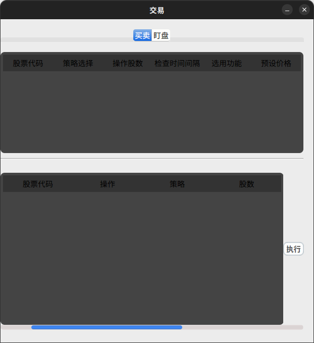
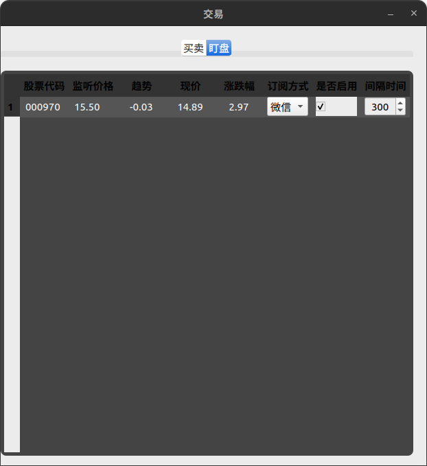
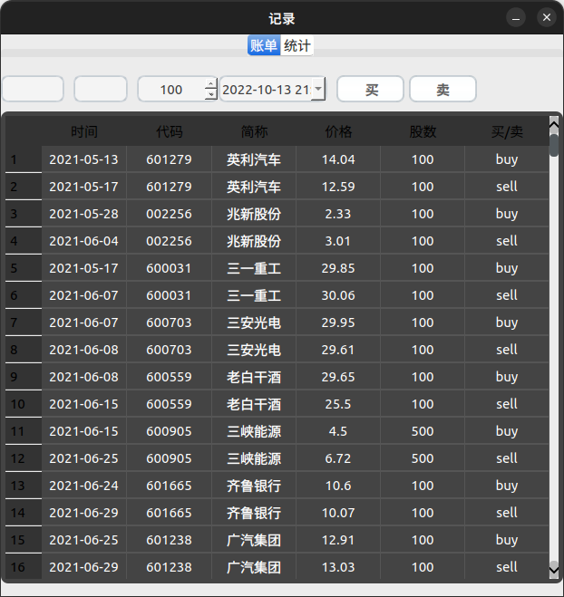

### 软件架构

##### github仓库：

**如果喜欢请给我个star!!!，十分感谢**

#### 准备工作:

- ##### 电脑必须得具备MySql数据库

建议初始化一个账号为root密码为88888888的用户

- ##### python运行环境

##### 下载python必需的库：

可直接运行命令

`pip install -r requirement.txt -i https://pypi.tuna.tsinghua.edu.cn/simple/`

##### 运行：

`python win_main.py`

#### 功能简述：

Web界面：

* 功能首页

  

* 设置页面

  

* 股票历史查询

  * 查询页

    

  * 数据页

    

    

    

    

* 基金历史查询

  *查询页跟股票查询页一样，不再展示*

  

  

* 场内基金查询

  *查询页跟股票查询页一样，不再展示*

  

* 股票指标数据查询

  

* 股票预测

  

* RSRS选股界面

  

  

  

  *RSRS的作用介绍网上有很多，无非就是期望得到超越大盘的收益，提前预测牛熊的到来，也可参考这篇文章《 真·躺着赚钱！写代码全自动炒股，五万元，半年后能赚多少？》https://mp.weixin.qq.com/s/fRXNLjgI-MoSO0TYdxAOeA*
  
* APB买卖压力因子

  

  忘记将日期标上去了，排序是最新一个交易日的（图片日期为2022,10,13）

  

  

Qt界面：

* 主界面（主界面主要展示三大指数、日常数据获取更新）
  
  *当点击按钮进行数据更新时，按钮状态变灰且不可再次点击，等更新完毕按钮恢复原状（所有的按钮都如此，运行状态不可重复点击）*
  
  
  
  
  
  ****
- 股票数据展示(热点股票页面、北向数据和龙虎榜)
  
  *鼠标右击可进行更新*
  
  
  
  
  
  ****

- 交易功能

  - 日常股票交易（买、卖、做套、可选策略：macd、kdj、网格交易）

  *机器盯盘，设置数据更新间隔，当股票出现上涨或下跌时，企业微信（邮箱）通知*

  

  **黄色为均价线，均价线会比价格线多出一个数据，这个数据是用dats根据过去时间的均价做出的时序预测，用以判断接下来的涨跌方向**

  ------

  

- 基金数据展示

  页面很多不再一一列出：

  * 基金（实时、历史、排行）
  * 场内基金（实时、历史、排行）
  * 新发基金（信息、排行）
  * 货币基金（新发、排行）

  

  

- 数据库检查

  

- 账单记录

  *记录买卖情况*
  
  

### 股票预测效果：

##### 企业微信通知：

- 更完善的界面

- 尽可能多的预测功能

- 尽可能多的策略选择

- 封装成独立软件形式

### 版本更新记录

----------- V1.4 ----------        忘记修复了啥

----------- V1.5 ----------        忘记修复了啥

----------- V1.6 ----------        忘记修复了啥

----------- V1.61 ----------        修复获取数据异常

----------- V1.62 ----------        修复遇到网络异常时处理逻辑

----------- V1.63 ----------        重构代码更符合pe-8规范

----------- V1.70 ----------        修复代码bug

----------- V1.80 ----------        运用cython加速

----------- V1.81 ----------       修复交易部分代码bug

----------- V1.82 ----------       更新交易策略部分代码逻辑

------------V1.9------------        增加web界面

------------V2.0------------        完善web界面

------------V2.1------------        修复下交易bug

------------V2.2------------        实现RSRS

------------V2.3------------        建立RSRS界面

------------V2.4------------        建立更多web界面

------------V2.5------------        仿mac改一下界面

------------V2.6------------        实现APB买卖压力因子（但没经过测试）

诚邀各位各位小伙伴一起完善或者迭代，联系方式qq:1602368639
